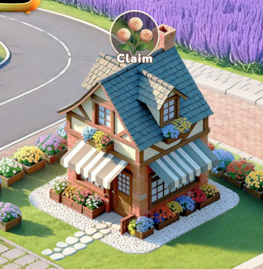
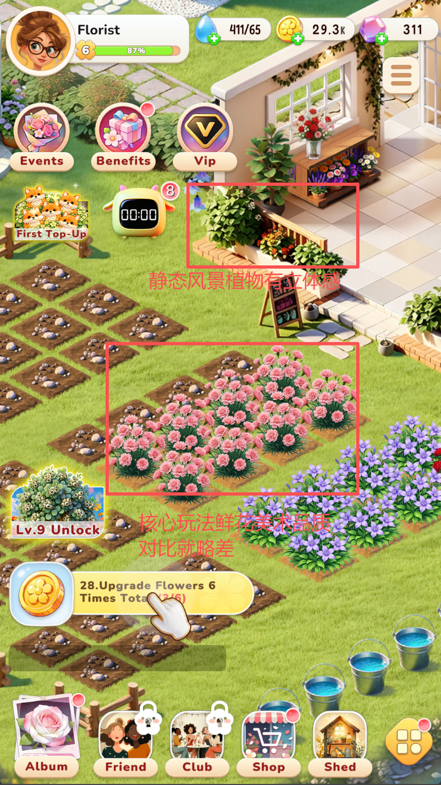
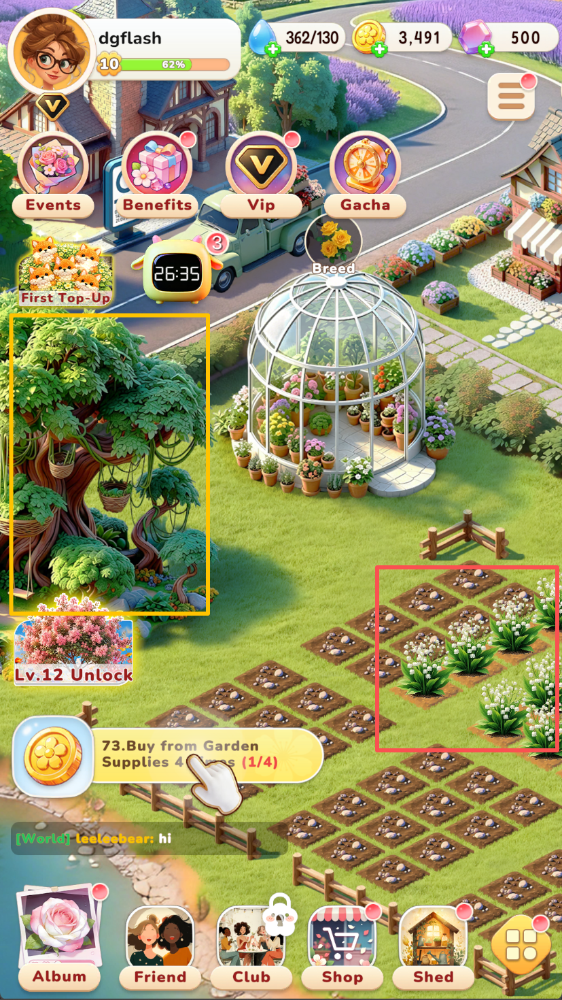
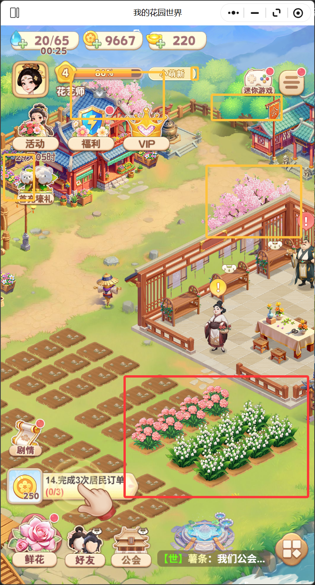

Booming Town 体验到10级后的玩家建议

***

## 程序问题

| 问题       | 描述                                                 |
| -------- | -------------------------------------------------- |
| 动画延迟     | Booming Town 比我的花园世界慢约 200ms，拖拽操作时鼠标划过地块没有即时反馈     |
| 渲染层级 Bug | 人物动画与建筑动画层级错误，房子把人脑袋盖住了。可以去测试，人物从这个房子走出来时的效果就可以重现了 |

***

### 美术建议

游戏进入时美术风格印象良好，但核心种花区域的画风与整体场景画风不一致；种花区域周边的建筑、植物美术表现优于主体玩法区域，反而衬托出核心玩法的视觉呈现弱于周边静态景物，导致玩家视觉焦点偏离核心玩法区。

 

**对比示例**：

| 对比项   | Booming Town（图1、图2，存在问题）                                                  | 我的花园世界（图3，参考标准）                               |
| ----- | ------------------------------------------------------------------------- | --------------------------------------------- |
| 周边景物  | 静态风景植物在立体感、细节刻画上表现过强，视觉权重高于核心玩法区；图3中左侧大树的精细度、色彩饱和度均明显高于右侧核心种花区，呈现"配角抢戏"问题 | 周边建筑、栅栏、樱花树风格统一，整体作为背景层，视觉权重明显弱于核心区           |
| 核心玩法区 | 种花区域花株细节不足、动态效果弱，与周边静态景物对比显得单薄                                            | 核心种花区是画面视觉重心，花株层叠、立体感强，与周围建筑形成"主角 vs 配角"的清晰层级 |
| 视觉聚焦  | 第一眼容易被右上角的静态植物盆栽或左侧大树吸引，主体玩法反被边缘化                                         | 打开界面后第一眼即锁定中央核心玩法区，周边景物自然退入背景                 |

**改进方向**：

- **视觉层级重塑**：以核心种花区域为画面视觉主角，周边建筑、装饰植物等场景元素作为视觉次要层，通过色彩饱和度、对比度、光照亮度的差异化处理，引导玩家视线自然聚焦于核心玩法区。
- **画风统一性**：核心种花区域与周边场景的画风需保持一致，建议主美对核心区的花株、土地、道具等素材进行专项美术检查与评审，参照周边场景已成熟的美术标准进行返工或重绘。
- **首屏视觉引导**：在界面打开瞬间，通过景深、动效、镜头聚焦等手法强化核心区的视觉吸引力，确保玩家第一眼即关注到主体玩法（参考《我的花园世界》的视觉处理方式）。
- **美术规范沉淀**：建立"核心区 > 周边场景"的美术优先级规范，避免后续内容迭代中再次出现主次倒置的问题。

***

### 策划建议

**前置说明**：由于缺乏游戏运营数据，无法精准定位节奏问题，但通过对比《我的花园世界》与《Booming Town》同期实际体验，节奏数值判断二者高度接近（可视为后者为前者的高仿版本）。不同海外用户群体对游戏体验的诉求存在差异，最终是否采纳以下建议需结合前期运营统计的留存数据综合判断。制定建议的主要目标为提升前期留存。

**核心问题**：玩家在 10 级左右时，主线循环（种花/浇水/收花）体验陷入重复，缺乏可调剂的支线内容，可能会导致部分玩家流失。

**建议方案**：

- **低成本剧情补充**：游戏中后期可参考《我的花园世界》的轻量级剧情表现手法（如对白气泡、立绘展示、静态场景切换），低成本植入剧情内容。现有开场剧情体验良好，可作为剧情表现的基准范式，并将其复用至中后期的体验重复阶段，让玩家逐步了解游戏世界观。
- **小游戏玩法填充**：在主循环间隙接入轻量级小游戏（如消消乐、浇水挑战、限时采摘等）作为调剂，延长玩家单局在线时长。
- **资源奖励反馈**：附加玩法通关后赠送肥料、钻石、种子等养成资源，使玩家从支线玩法中获得进度反馈，反哺主线养成。
- **双轨体验设计**：构建"主循环（种花-浇水-收花）+ 副玩法（剧情/小游戏）"的双轨内容结构，降低单一核心玩法的枯燥感，延缓玩家在中期阶段的疲劳与流失。

***

