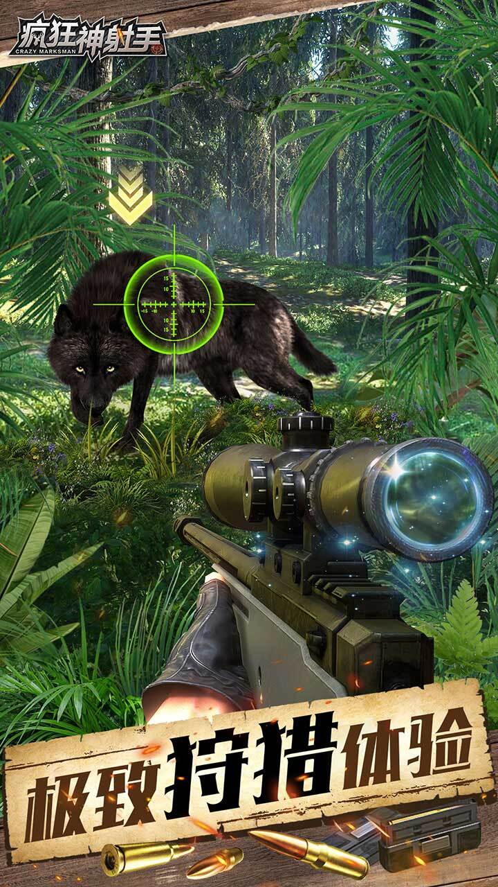
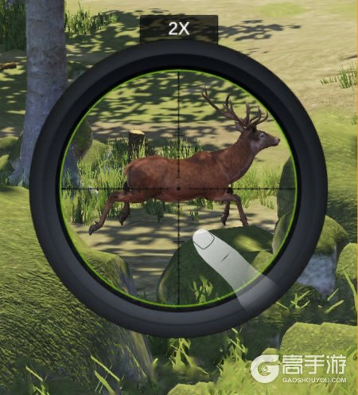
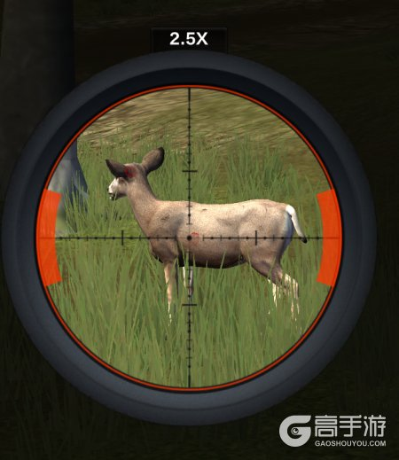

# 疯狂神射手 游戏设计文档

> **文档版本**：v1.0  
> **整理日期**：2026-06-22  
> **适用版本**：v1.0.1.7 及后续热更新（最新官方公告 2026-06-16）  
> **游戏类型**：3D 第一人称模拟狩猎 / 狙击竞技 / 微信小游戏  
> **开发商**：北京赫德时代科技有限公司  
> **游戏版号**：ISBN 978-7-498-14198-9  
> **官方客服**：QQ 公众号 8000110808  
> **官方微信公众号**：疯狂神射手

---

## 目录

1. [游戏定位与核心体验](#一游戏定位与核心体验)
2. [核心玩法设计](#二核心玩法设计)
3. [游戏模式设计](#三游戏模式设计)
4. [养成系统设计](#四养成系统设计)
5. [社交与公会系统](#五社交与公会系统)
6. [经济系统设计](#六经济系统设计)
7. [任务与活动系统](#七任务与活动系统)
8. [场景与生态环境](#八场景与生态环境)
9. [数值设计](#九数值设计)
10. [版本规划与更新记录](#十版本规划与更新记录)
11. [待确认事项](#十一待确认事项)
12. [附录](#十二附录)

---

## 一、游戏定位与核心体验

### 1.1 游戏概述

《疯狂神射手》是一款以**第一人称模拟狩猎**为核心的 3D 射击类微信小游戏，兼具 PVE 狩猎闯关与 PVP 竞技对抗。玩家扮演荒野猎手，在灌木林、乔木林、雪原、非洲草原、侏罗纪等多样化场景中，追踪并狩猎各类野生动物，通过真实射击手感与拟真物理机制，体验"一击必杀"的狩猎快感。



*图：游戏主界面展示*

### 1.2 核心体验目标

| 体验维度 | 目标描述 | 设计要点 |
|---------|---------|---------|
| **沉浸感** | 3D 真实生态场景、动态天气、动物真实习性，还原狩猎氛围 | 场景美术、天气系统、动物AI |
| **操作感** | 单指滑动瞄准 + 点击/松手射击，简洁但强调精准度 | 操作简化、反馈强化 |
| **真实感** | 结合风速、弹道下坠等拟真物理机制 | 物理引擎、弹道计算 |
| **成长感** | 枪械、配件、宝石、宠物、卡牌、养殖等多线养成 | 数值成长、目标感 |
| **竞技感** | 1v1 真人匹配、排行榜、积分制比拼 | PVP匹配、排名系统 |
| **社交感** | 组队副本、好友互访、公会、排行榜 | 社交互动、协作玩法 |

### 1.3 核心 Slogan

- 精英猎手集结，在荒野中挑战百兽之王。
- 狩猎场任你探索，竞技场展现实力。
- 扣动扳机，书写你的狩猎传奇。

---

## 二、核心玩法设计

### 2.1 基础操作

| 操作 | 方式 | 需求说明 |
|------|------|----------|
| **开镜** | 点击屏幕 | 打开倍镜进入瞄准状态 |
| **瞄准** | 单指滑动 | 调整准星位置，支持风速/弹道预判 |
| **射击** | 松开手指 | 完成射击动作 |
| **结算** | 自动 | 命中后计算击杀分、精准分与加成 |

**设计要点**：
- 无复杂移动，角色固定位置，专注于瞄准与射击
- 新手期显示动物弱点提示，后期依赖配件透视
- 操作简洁但强调精准度与策略性



*图：瞄准操作示意图*



*图：射击命中效果*

### 2.2 战斗流程

```
进入狩猎场/竞技场 → 探索/匹配 → 发现猎物 → 开镜瞄准 → 
观察要害（新手期显示/后期配件透视） → 考虑风速、弹道下坠 → 
预判射击点 → 射击 → 命中判定 → 分数结算
```

### 2.3 计分规则

#### 2.3.1 计分公式

```
总分 = (击杀分 + 精准分) × 加成
```

#### 2.3.2 分数构成

| 分数类型 | 说明 | 影响因素 |
|---------|------|----------|
| **击杀分** | 击杀猎物获得的基础分数 | 动物类型、动物体型、关卡难度 |
| **精准分** | 命中要害/弱点的额外奖励 | 命中部位、射击距离、连击数 |
| **加成** | 各类加成系数 | 枪械、子弹、配件、宝石、卡牌、动物体型/类型 |

### 2.4 动物类型设计

#### 2.4.1 类型分类

| 类型 | 属性特点 | 出现场景 | 设计目的 |
|------|---------|----------|----------|
| **普通类** | 基础属性，标准分数 | 主线狩猎场、普通卡包 | 基础体验、新手友好 |
| **白化类** | 属性与击杀分高于普通类 | 精英狩猎、高级卡包 | 稀有度、收藏价值 |
| **感染类** | 属性大幅提升，难度显著增加 | 狩猎场 46 关后、后期关卡 | 难度递进、后期挑战 |

#### 2.4.2 体型分类

- **小型**：速度快、血量低、分数基础
- **中型**：平衡型、中等血量与分数
- **大型**：速度慢、血量高、高分值

**设计要点**：不同体型对应不同的枪械、宝石、卡牌加成策略。

---

## 三、游戏模式设计

### 3.1 主线狩猎场（PVE 闯关）

#### 3.1.1 模式定位

主线狩猎场是游戏最核心的 PVE 玩法，玩家依次挑战各关卡，击败关卡内所有动物即可通关。


*图：狩猎场场景展示*

#### 3.1.2 玩法规则

| 规则项 | 设计说明 |
|--------|----------|
| **关卡信息** | 点击关卡左上角"？"图标，可查看该关卡可能出现的动物及掉落奖励 |
| **探索机制** | 进入狩猎场探索会随机获得奖励，金币大奖随缘刷出 |
| **进入条件** | 当探索出现三个标靶时，即刻进入狩猎场开始狩猎 |
| **通关条件** | 击败关卡内所有动物即视为通关 |
| **奖励内容** | 金币、钻石、宝箱（概率开出金币、枪械等） |
| **关卡上限** | **210 关**（2026-06-16 官方公告确认） |
| **难度递进** | 通关 45 关后开始出现感染类动物 |

#### 3.1.3 关卡扩展记录

| 版本日期 | 新增关卡 | 说明 |
|---------|---------|------|
| 2026-06-16 | 扩充至 210 关 | 最新版本确认 |
| 2026-04-03 | 新增 161-180 关 | v1.0.1.7 |
| 2026-03-05 | 新增 121-160 关 | v1.0.1.6 |

### 3.2 竞技场（PVP 1v1）

#### 3.2.1 模式定位

真人匹配，狩猎 PK，1v1 比拼狩猎积分，胜者赢得比赛奖金。

#### 3.2.2 玩法规则

| 规则项 | 设计说明 |
|--------|----------|
| **对战形式** | 真人匹配，三局对战，以总分论胜负 |
| **参赛费用** | 提交费用参赛，胜利获得比赛奖金 |
| **奖杯解锁** | 积累奖杯解锁后续竞技场关卡 |
| **关卡上限** | **31 关**（2026-06-16 官方公告确认） |
| **宝箱规则** | 前 8 次胜利必得箱子，之后概率获得 |
| **排行榜** | 实时积分排名 |

#### 3.2.3 关联系统解锁

| 竞技场关卡 | 解锁内容 |
|-----------|---------|
| 4 关 | 解锁组队挑战 |
| 8 关 | 开放巅峰竞技场入口 |
| 10 关 | 解锁徽章系统 |
| 12 关 | 解锁巅峰竞技场功能 |

### 3.3 巅峰竞技场

#### 3.3.1 模式定位

高端竞技玩法，提供更高段位挑战与排名。

#### 3.3.2 玩法规则

| 规则项 | 设计说明 |
|--------|----------|
| **入口** | 竞技场 8 级开放入口 |
| **功能解锁** | 竞技场 12 级解锁功能 |
| **段位** | 2026-06-16 版本新增**神话段位** |
| **定位** | 高端竞技玩法，提供更高段位挑战与排名 |

### 3.4 狩猎挑战（野外试炼）

#### 3.4.1 模式定位

持久战/波次生存挑战，通关当前关卡后挑战更高层级。

#### 3.4.2 玩法规则

| 规则项 | 设计说明 |
|--------|----------|
| **玩法类型** | 持久战/生存波次挑战 |
| **规则** | 每通关当前关卡，挑战更高层级的狩猎；击败关卡内所有动物即通关 |
| **关卡上限** | **280 关**（2026-06-16 官方公告确认） |
| **次数** | 每天免费 3 次；可购买 3 次；可通过广告获得额外次数 |
| **次数保留** | 当日未参与可保留活动次数，最多保留 3 天 |
| **失败惩罚** | 挑战失败无奖励，消耗 1 次活动次数 |
| **奖励** | 金币、钻石、动物卡包（后续卡包有更高概率开出超稀有动物图鉴） |
| **排行榜** | 狩猎挑战排行榜，展示最高通关关卡记录 |

### 3.5 自由狩猎场

| 规则项 | 设计说明 |
|--------|----------|
| **定位** | 自由狩猎体验场景 |
| **当前上限** | **6 阶**（2026-06-16 官方公告确认） |
| **用途** | 获取特定资源、无拘束狩猎体验 |

### 3.6 高山狩猎场

| 规则项 | 设计说明 |
|--------|----------|
| **解锁条件** | 通关狩猎场第 7 关 |
| **产出** | 高山水晶 |
| **用途** | 高山水晶兑换黑曜石钥匙（开启配件宝箱） |
| **关卡上限** | **22 关**（2026-06-16 官方公告确认） |

### 3.7 组队副本（双人合作）

#### 3.7.1 模式定位

双人组队狩猎玩法，玩家可邀请好友一同挑战更具难度的关卡。

#### 3.7.2 玩法规则

| 规则项 | 设计说明 |
|--------|----------|
| **解锁条件** | 达到竞技场关卡 4 解锁组队挑战 |
| **组队形式** | 邀请好友组成双人小队，共同进入副本狩猎 |
| **关卡上限** | **30 关**（2026-06-16 官方公告确认） |
| **关卡奖励** | 每成功通关一个关卡，队伍可领取得分礼包 |
| **资源产出** | 宝石、组队星币 |
| **兑换商店** | 组队星币可兑换宝石数据卡、洗涤药剂、枪械宝箱 |
| **成就系统** | 完成组队副本中的成就任务获得积分，提升成就等级，领取成就等级奖励 |
| **排行榜** | 成就积分排行榜每周结算，奖励通过邮件自动发放 |

### 3.8 靶场训练营

| 规则项 | 设计说明 |
|--------|----------|
| **开放时间** | 每周一至周四 |
| **定位** | 射击技巧训练与专项练习 |
| **奖励** | 参与活动可获取资源奖励 |

### 3.9 世界 BOSS / 公会 BOSS

| 规则项 | 设计说明 |
|--------|----------|
| **公会 BOSS 关卡上限** | **18 关**（2026-06-16 官方公告确认） |
| **世界 BOSS** | 2026-05-26 版本提升血量上限，增加挑战难度 |
| **公会远征** | 2026-05-26 版本调整为按实际伤害计算分数 |

---

## 四、养成系统设计

### 4.1 枪械系统

#### 4.1.1 枪械类型

| 类型 | 特点 | 适用场景 |
|------|------|----------|
| **狙击步枪** | 高伤害、高精度，适合远距离要害射击 | 核心狩猎武器 |
| **步枪/中程枪械** | 适用于中程输出 | 中距离作战 |
| **弓箭** | 传统狩猎武器 | 特定狩猎场景 |
| **手枪** | 无法触发双发效果 | 辅助武器 |


*图：M24狙击步枪展示*


*图：AWM狙击步枪展示*


*图：R93狙击步枪展示*

#### 4.1.2 枪械获取与培养

| 项目 | 说明 |
|------|------|
| **获取方式** | 宝箱抽取、关卡掉落、活动奖励、首充礼包、商城购买 |
| **培养方式** | 升级、升阶、突破 |
| **枪械皮肤** | SSG08-星霜白喙（2026-06-16）、AWM-轮回（v1.0.1.7） |
| **品质** | 按品质划分，越高阶枪械基础属性越高 |
| **最高阶** | T6（AX50-极渊蝰影，2026-05-26 新增） |

#### 4.1.3 枪械推荐策略

- **新手期**：优先解锁和升级基础狙击步枪，操作相对简单
- **后期**：追求高阶枪械（如 5 阶 SSG08-焱翎）
- **场景选择**：狩猎场堆伤害，竞技场冲积分

### 4.2 子弹系统

| 项目 | 说明 |
|------|------|
| **分类** | 按颜色/品质区分（红、橙、蓝等） |
| **作用** | 不同子弹对应不同积分加成与伤害效果 |
| **获取** | 卡包、关卡、活动、商店 |
| **典型搭配** | 橙色子弹【原子】搭配稀有枪械【Barrett-胜利者】 |

### 4.3 配件系统

#### 4.3.1 解锁条件

通关狩猎场第 7 关后解锁枪械配件、配件宝箱、高山猎场。解锁同时开放配件冲刺活动，助力快速获取配件。

#### 4.3.2 配件部位

| 部位 | 功能定位 |
|-----|---------|
| **弹夹** | 影响射速、装弹、特殊射击效果 |
| **握把** | 影响基础伤害、暴击/暴伤、分数奖励 |
| **枪口** | 影响伤害、弹道稳定性 |
| **枪托** | 影响伤害、体型加成 |
| **倍镜** | 影响瞄准精度、透视效果、特定枪械加成 |

#### 4.3.3 配件品质与养成

| 项目 | 说明 |
|------|------|
| **品质** | 普通 → 稀有 → 史诗 → 传说 → 橙色 → 彩色（v1.0.1.6 新增） |
| **等级上限** | **40 级**（2026-06-16 官方公告确认） |
| **升级** | 消耗资源提升配件等级，解锁更多增益效果 |
| **合成** | 低品质配件可合成为高品质配件；S 级配件合成时进行二次提醒 |

#### 4.3.4 配件获取途径

- 商城配件宝箱（消耗黑曜石钥匙）
- 高山猎场产出高山水晶，兑换黑曜石钥匙
- 公会商店概率刷新黑曜石钥匙
- 开启 8 级以上宝箱有概率掉落配件

#### 4.3.5 特殊配件效果

| 配件名称 | 品质/部位 | 特殊效果 | 适用场景 |
|---------|----------|---------|---------|
| S・幽灵静音弹夹 | 紫色/弹夹 | 连续射出 2 发子弹，间隔 0.4 秒，最终伤害降低 38% | 伤害不足但需提升击杀效率 |
| S・抗震狙击镜 | 蓝色/倍镜 | 开镜透视 +0.6 秒 | 显示猎物弱点，助力精准命中 |
| S・秃鹰狙击镜 | 蓝色/倍镜 | 开镜透视 +0.6 秒 | 同上 |
| 鱼骨狙击镜 | 橙色/倍镜 | 开镜透视 +0.6 秒 | 同上 |
| ST 狙击弹夹 | 紫色/弹夹 | 第一次射击增加 20% 暴击率 | 第一枪打高血量猎物 |

### 4.4 宝石系统

#### 4.4.1 解锁条件

通关狩猎场第 7 关后解锁宝石系统。

#### 4.4.2 宝石基础规则

| 项目 | 说明 |
|------|------|
| **部位** | 宝石分为 5 个部位，对应枪械配件的 5 个部位 |
| **品级** | 共分 7 个品级，品质越高属性越强 |
| **镶嵌规则** | 每个枪械配件部位最多镶嵌 5 颗宝石；同部位无法镶嵌两条相同属性词条 |
| **洗炼** | 橙色及以上品级的宝石支持洗炼，重新生成宝石属性 |
| **合成** | 同部位低品质宝石可合成为高品级宝石 |
| **锁定** | 稀有宝石可提前锁定，锁定后无法参与合成与洗炼；同词条、部位、品质的宝石会一起锁定 |

#### 4.4.3 宝石属性分类

| 类别 | 属性示例 | 适用场景 |
|-----|---------|---------|
| **伤害类** | 百分比伤害、额外伤害、固定伤害、暴击率、暴击伤害、种族增伤（恐龙/巨型等） | 狩猎场核心 |
| **积分类** | 红/橙/蓝子弹积分、各类目标积分加成 | 竞技场冲分 |
| **特殊功能类** | 不消耗子弹、射速提升 | 按需搭配 |
| **体型加成** | 对小型/中型/大型动物加成 | 针对性狩猎 |
| **类型加成** | 对感染类动物加成 | 后期感染关卡 |
| **枪械加成** | 对特定枪械类型伤害加成（如 M200 类型枪械伤害 +6%） | 枪械专用 |

#### 4.4.4 宝石搭配策略

**狩猎场（PVE）**：
- 核心：百分比伤害、暴击率、暴击伤害
- 补充：对应种族/体型增伤（恐龙/巨型优先）
- 禁忌：不佩戴任何积分宝石，纯输出拉满

**竞技场（PVP）**：
- 能一枪秒杀：多带积分宝石，快速刷分登顶
- 无法秒杀：保留部分伤害宝石，保证击杀效率

**宝石合成优先级**：
1. 先填满所有宝石槽
2. 优先升级核心属性：百分比伤害 > 暴击率 > 暴击伤害 > 固定/额外伤害
3. 固定/额外伤害宝石后期不建议升级，留作合成材料

#### 4.4.5 资源获取

| 资源 | 获取方式 | 用途 |
|------|----------|------|
| **宝石** | 组队挑战玩法 | 镶嵌提升属性 |
| **组队星币** | 组队挑战产出 | 兑换宝石数据卡、洗涤药剂 |
| **宝石数据卡** | 组队星币兑换 | 开启宝石箱，最高可获得橙色品质宝石 |
| **洗涤药剂** | 组队星币兑换、积分商店 | 宝石洗炼 |
| **积分商店** | 60 积分可兑换 5 个洗炼药剂，每周刷新 | - |

### 4.5 卡牌/图鉴系统

#### 4.5.1 系统概述

集卡系统为玩家收藏动物卡牌，每张卡牌提供不同的加成能力，升级卡牌可提升卡牌技能，在狩猎结束时提供更多分数。

#### 4.5.2 卡牌获取

- 每次狩猎可获取卡牌碎片
- 狩猎场关卡奖励、动物卡包
- 不同栖息地对应不同卡包

#### 4.5.3 卡牌属性

| 属性 | 说明 |
|------|------|
| **基础属性** | 重量、血量、防御、击杀分、精准分、体型、栖息地、动物类型 |
| **升级效果** | 提升卡牌技能与狩猎结束分数加成 |
| **栖息地分类** | 灌木林、乔木林、雪原、非洲草原、侏罗纪等 |
| **集卡类别** | v1.0.1.6 新增侏罗纪恐龙集卡类别 |

#### 4.5.4 典型卡牌示例（灌木林）

| 动物 | 体型 | 血量 | 防御 | 击杀分 | 精准分 | 栖息地 |
|-----|-----|------|------|--------|--------|--------|
| 美洲鳄 | 大型 | 1350-2700 | 100-200 | 2700-5400 | 900-1800 | 灌木林 |
| 美洲野牛 | 大型 | 待补充 | 待补充 | 待补充 | 待补充 | 灌木林 |
| 红鹿 | 大型 | 待补充 | 待补充 | 待补充 | 待补充 | 灌木林 |

### 4.6 宠物系统

#### 4.6.1 系统概述

宠物系统为玩家提供战斗伙伴或养成对象，宠物可升阶提升属性。

#### 4.6.2 养成规则

| 项目 | 说明 |
|------|------|
| **获取方式** | 通过养殖场动物成年后兑换宠物币，或在特殊商人处兑换 |
| **升阶** | 宠物最高可升至 **15 阶**（2026-06-16 官方公告确认） |
| **作用** | 提供属性加成或战斗辅助 |
| **商店** | 宠物商店 UI 在 2026-06-16 版本优化 |

### 4.7 配饰系统

| 项目 | 说明 |
|------|------|
| **定位** | 角色外观或属性加成系统 |
| **最高等阶** | **14 阶**（2026-06-16 官方公告确认） |
| **商店** | 配饰商店 UI 在 2026-06-16 版本优化 |

### 4.8 养殖场系统

#### 4.8.1 系统概述

养殖系统是休闲养成与经济产出系统，玩家可以养殖动物幼崽，成年后出售换取资源。

#### 4.8.2 养殖场类型

| 类型 | 说明 |
|------|------|
| **普通养殖场** | 养殖普通动物幼崽 |
| **猛兽养殖场** | 养殖猛兽类幼崽 |

#### 4.8.3 养殖流程

```
选择动物幼崽放入养殖场 → 使用加速药剂让幼崽快速成长 → 
等待动物成长至成年 → 成年后出售，换取金币/钻石/宠物币
```

#### 4.8.4 养殖场升级

- 花费金币升级养殖场
- 升级后提高动物养殖上限，提升后续收益

#### 4.8.5 社交与彩蛋

| 功能 | 说明 |
|------|------|
| **好友拜访** | 每天有 5 次拜访次数，可探访其他玩家养殖场 |
| **偷取动物** | 拜访时有一定概率偷取其他玩家的养殖动物，存在获取上限 |
| **互赠体力** | 互相加好友后，每天可互相赠送体力 |
| **神秘彩蛋** | 点击养殖场内的石头或动物便便进行清理，可能获得惊喜奖励 |

### 4.9 女神养成系统

| 项目 | 说明 |
|------|------|
| **新增时间** | 2025-10-13 版本 |
| **系统概述** | 玩家可邂逅多位女神角色，通过养成丰富狩猎旅途 |
| **具体规则** | 需以游戏内实际实现为准，可能包含好感度、属性加成等机制 |

### 4.10 徽章系统

| 项目 | 说明 |
|------|------|
| **解锁条件** | 竞技场达到 10 级后解锁 |
| **系统概述** | 收集徽章，可能提供属性加成或展示效果 |
| **获取方式** | 通过竞技场、活动等途径获得 |
| **新增时间** | v1.0.1.6 |

---

## 五、社交与公会系统

### 5.1 好友系统

| 功能 | 说明 |
|------|------|
| **添加好友** | 添加好友，互赠体力 |
| **拜访养殖场** | 拜访好友养殖场，可偷取动物或获得金币 |

### 5.2 公会系统

#### 5.2.1 公会功能

| 功能 | 说明 |
|------|------|
| **公会商店** | 概率刷新黑曜石钥匙等稀有道具 |
| **公会 BOSS** | 多人协作挑战 BOSS，最高 18 关（2026-06-16） |
| **公会远征** | 按实际伤害计算分数（2026-05-26 调整） |
| **公会联赛** | 公会间联赛对抗，报名参赛，挑战其他公会 |

### 5.3 排行榜

| 排行榜类型 | 说明 |
|-----------|------|
| **狩猎挑战排行榜** | 展示最高挑战关卡记录 |
| **组队成就排行榜** | 每周结算成就积分排名 |
| **竞技场排行榜** | 展示 PVP 积分排名 |
| **全服/好友排行榜** | 支持好友间对比 |

---

## 六、经济系统设计

### 6.1 主要货币

| 货币 | 用途 | 获取方式 |
|------|------|----------|
| **金币** | 升级配件、升级养殖场、购买基础资源 | 狩猎场奖励、关卡宝箱、养殖出售、每日市场、观看广告 |
| **钻石** | 高级抽卡、购买道具、复活 | 任务奖励、充值、活动、成就、关卡奖励 |
| **组队星币** | 兑换宝石数据卡、洗涤药剂、枪械宝箱 | 组队副本产出 |
| **高山水晶** | 兑换黑曜石钥匙 | 高山猎场产出 |
| **宠物币** | 兑换宠物相关资源 | 养殖动物出售给特殊商人 |
| **黑曜石钥匙** | 开启配件宝箱 | 高山猎场兑换、公会商店、活动 |

### 6.2 资源获取途径

| 途径 | 说明 |
|------|------|
| **免费奖励** | 日常任务、周常任务、通行证日常任务、三个免费广告档位 |
| **活动列表** | 首充、七日签到、通行证、嘉年华等活动 |
| **邀请有礼** | 邀请好友加入游戏，最多可邀请 5 人，获得钻石、体力、宝箱钥匙等 |
| **关卡奖励** | 通关狩猎场、竞技场、试炼玩法获得 |
| **养殖产出** | 出售成年动物 |
| **广告奖励** | 观看广告补充体力、获取额外挑战次数、领取免费资源 |
| **礼包码** | 每周官方发放礼包码，通过设置-礼包码兑换 |

### 6.3 付费点设计

| 付费项 | 说明 |
|--------|------|
| **首充礼包** | 6 元、30 元、68 元三档，签到三天领取奖励；6 元档包含 M24-嘣 枪械、老虎幼崽、动物卡包、钻石、饮料、子弹等 |
| **通行证** | 周期性付费通行证，完成任务解锁奖励 |
| **嘉年华** | 限时活动，付费获取资源 |
| **钻石充值** | 用于抽卡、购买道具、刷新商店 |
| **广告变现** | 观看广告获取体力、挑战次数、免费资源 |

---

## 七、任务与活动系统

### 7.1 日常/周常任务

| 任务类型 | 说明 |
|---------|------|
| **日常任务** | 每日刷新，奖励钻石、金币 |
| **周常任务** | 每周刷新，奖励更高 |
| **通行证任务** | 解锁通行证等级奖励 |

### 7.2 七日签到

- 新手七日签到送枪械碎片、动物幼崽等
- 持续登录领取累计奖励

### 7.3 通行证系统

- 周期性成长通行证
- 完成任务提升通行证等级
- 免费档与付费档奖励并存

### 7.4 首充礼包

| 档位 | 内容 |
|------|------|
| **6 元档** | M24-嘣 枪械、老虎幼崽、动物卡包、钻石、饮料、子弹等（性价比最高） |
| **30 元档** | 签到三天领取奖励 |
| **68 元档** | 签到三天领取奖励 |

### 7.5 邀请有礼

- 复制链接邀请好友
- 最多邀请 5 人
- 奖励：钻石、体力、宝箱钥匙等

### 7.6 每周福利

- 官方每周一发布礼包码
- 兑换方式：设置 → 礼包码 → 输入兑换

### 7.7 版本活动

| 活动名称 | 说明 |
|---------|------|
| **巅峰竞技场** | 竞技场 8 级开放入口，12 级解锁功能 |
| **靶场训练营** | 每周一至周四开放 |
| **恐龙限定狩猎** | 节日/版本活动期间开放 |
| **配件冲刺活动** | 解锁配件系统时同步开放 |

---

## 八、场景与生态环境

### 8.1 场景类型

| 场景 | 特点 |
|------|------|
| **灌木林** | 基础场景，新手友好 |
| **乔木林** | 中等难度场景 |
| **雪原** | 寒冷环境，特殊动物 |
| **非洲草原** | 开阔场景，大型动物 |
| **雨林** | 茂密植被，隐蔽猎物 |
| **高山猎场** | 高山环境，产出高山水晶 |
| **侏罗纪** | 恐龙场景，v1.0.1.6 新增 |


*图：灌木林狩猎场景*


*图：雪原狩猎场景*


*图：游戏实际画面展示*

### 8.2 环境动态

| 环境要素 | 设计说明 |
|---------|---------|
| **动态天气系统** | 影响狩猎难度，增加游戏变化性 |
| **动物真实习性** | 动物行为符合真实生态，需针对性瞄准 |
| **风速、弹道下坠** | 拟真物理机制，增加射击策略性 |

### 8.3 动物生态

| 类型 | 说明 |
|------|------|
| **真实野生动物** | 鹿、熊、狼、棕熊、野猪、猎狗、鸵鸟、鳄鱼、野牛、豹子、白熊等数十种 |
| **侏罗纪恐龙** | 恐龙类猎物，v1.0.1.6 新增 |
| **要害/弱点** | 动物存在要害/弱点，新手期显示，后期依赖配件透视 |

---

## 九、数值设计

### 9.1 当前版本关键数值上限汇总

| 系统 | 当前上限 | 确认时间 | 备注 |
|------|----------|----------|------|
| **狩猎场关卡** | 210 关 | 2026-06-16 | - |
| **竞技场关卡** | 31 关 | 2026-06-16 | - |
| **狩猎挑战关卡** | 280 关 | 2026-06-16 | - |
| **高山狩猎场关卡** | 22 关 | 2026-06-16 | - |
| **自由狩猎场** | 6 阶 | 2026-06-16 | - |
| **公会 BOSS** | 18 关 | 2026-06-16 | - |
| **组队活动** | 30 关 | 2026-06-16 | - |
| **宠物等阶** | 15 阶 | 2026-06-16 | - |
| **配饰等阶** | 14 阶 | 2026-06-16 | - |
| **配件等级** | 40 级 | 2026-06-16 | - |
| **巅峰竞技场** | 神话段位 | 2026-06-16 | 新增段位 |
| **枪械最高阶** | T6（AX50-极渊蝰影） | 2026-05-26 | 可开启守护槽位 |

### 9.2 动物数值示例

#### 9.2.1 灌木林动物

| 动物 | 体型 | 血量 | 防御 | 击杀分 | 精准分 |
|-----|-----|------|------|--------|--------|
| 美洲鳄 | 大型 | 1350-2700 | 100-200 | 2700-5400 | 900-1800 |
| 美洲野牛 | 大型 | 待补充 | 待补充 | 待补充 | 待补充 |
| 红鹿 | 大型 | 待补充 | 待补充 | 待补充 | 待补充 |

**注**：具体数值表（动物血量、防御、击杀分、精准分；枪械、配件、宝石各等级数值）待进一步确认。

---

## 十、版本规划与更新记录

### 10.1 最新版本确认信息

- **最新客户端版本号**：v1.0.1.7（2026-04-03 更新，应用宝/各大安卓渠道）
- **最新官方公告日期**：2026-06-16（维护公告，2026-06-17 执行）
- **最新版本新增重点**：
  - 关卡全面扩容：狩猎场 210 关、竞技场 31 关、狩猎挑战 280 关、高山狩猎场 22 关、公会 BOSS 18 关、组队活动 30 关、自由狩猎场 6 阶
  - 成长线扩容：宠物最高 15 阶、配饰最高 14 阶、配件最高 40 级
  - 新增枪械皮肤：SSG08-星霜白喙
  - 巅峰竞技场新增"神话段位"
  - 商城、宠物商店、配饰商店 UI 优化

### 10.2 版本更新记录

| 日期 | 版本/公告 | 核心内容 |
|------|----------|----------|
| **2026-06-16** | 6 月更新维护公告 | 自由狩猎场 6 阶、竞技场 31 关、狩猎场 210 关、狩猎挑战 280 关、高山狩猎场 22 关、公会 BOSS 18 关、组队 30 关；宠物 15 阶、配饰 14 阶、配件 40 级；新增 SSG08-星霜白喙皮肤；巅峰竞技场新增神话段位；商店 UI 优化 |
| **2026-06-09** | 合服公告 | 枫林鹿场-01 至枫林鹿场-05 合服，数据保留，排行榜重新排序 |
| **2026-05-26** | 5 月更新公告 | 新增 T6 枪械 AX50-极渊蝰影（可开启守护槽位）；提升世界 BOSS 血量上限；优化段位、成就名称；公会远征按实际伤害计分 |
| **2026-04-03** | v1.0.1.7 | 新增宠物系统、新增枪械皮肤 AWM-轮回；关卡扩充：狩猎场 161-180、竞技场 25-28、狩猎挑战 221-240、高山猎场 17-19、公会 BOSS 13-16、组队 23-26 |
| **2026-03-05** | v1.0.1.6 | 新增彩色品质配件、徽章系统、靶场训练营、侏罗纪恐龙、集卡类别；扩充关卡：竞技场 21-24、狩猎场 121-160、5 阶自由狩猎场、狩猎挑战 181-220、高山猎场 13-16、组队 19-22 |
| **2025-10-13** | 10 月更新 | 新增女神养成系统；优化通行证、修复组队/竞技场问题 |
| **2025-08-01** | 首发 | 核心玩法上线 |

---

## 十一、待确认事项

以下内容为官方公告提及但具体机制尚未明确公开，需求阶段需进一步确认：

| 序号 | 待确认事项 | 说明 |
|------|-----------|------|
| 1 | **守护槽位机制** | AX50-极渊蝰影 可开启守护槽位，具体守护效果、解锁条件、养成方式待确认 |
| 2 | **神话段位规则** | 巅峰竞技场神话段位的积分要求、奖励、赛季机制待确认 |
| 3 | **宠物战斗机制** | 宠物在战斗中的具体表现、技能释放、属性加成方式待确认 |
| 4 | **女神养成系统** | 具体养成规则、属性加成、交互方式待确认 |
| 5 | **公会联赛完整规则** | 报名、匹配、积分、奖励待确认 |
| 6 | **徽章系统具体效果** | 徽章属性加成、获取途径、展示方式待确认 |
| 7 | **具体数值表** | 动物血量、防御、击杀分、精准分；枪械、配件、宝石各等级数值待确认 |

---

## 十二、附录

### 12.1 官方参考资料

#### 12.1.1 官方公告与资讯

- [TapTap《疯狂神射手》官方论坛](https://www.taptap.cn/app/748237/topic)
- [《疯狂神射手》6 月 16 日更新维护公告 - TapTap](https://www.taptap.cn/moment/815967588457647193)
- [《疯狂神射手》6 月 9 日合服公告 - TapTap](https://www.taptap.cn/moment/813004044707563790)
- [《疯狂神射手》5 月 26 日更新公告 - TapTap](https://www.taptap.cn/moment/808048251843383012)
- [《疯狂神射手》野外试炼-狩猎挑战 - TapTap](https://www.taptap.cn/moment/700422324624557352)
- [【狩猎小报】更新前瞻-组队玩法+宝石系统即将上线 - TapTap](https://www.taptap.cn/moment/709374211252028466)
- [《疯狂神射手》6 月 16 日更新维护公告 - 高手游](https://www.gaoshouyou.com/zhuanqu/967076.html)
- [《疯狂神射手》5 月 26 日更新公告 - 高手游](https://www.gaoshouyou.com/zhuanqu/961576.html)
- [《疯狂神射手》6 月 9 日合服公告 - 高手游](https://www.gaoshouyou.com/zhuanqu/965060.html)

#### 12.1.2 游戏下载与资料页

- [7k7k《疯狂神射手》微信小游戏](https://www.7k7k.com/wxgame/2756.htm)
- [飞游网《疯狂神射手》v1.0.1.6 资料](https://www.f71.com/game/326790.html)
- [脚本之家《疯狂神射手》官方版 v1.0.1.7](https://www.jb51.net/game/994708.html)
- [多特手游网《疯狂神射手》官方正版](https://www.duote.com/android/1174715.html)

### 12.2 文档维护说明

本文档基于**官方 TapTap 论坛**、**官方合作媒体公告**以及**微信小游戏官方入口**整理，聚焦截至 2026 年 6 月 22 日已确认的最新版本内容。

**文档维护建议**：
- 定期同步官方公告，更新版本信息
- 补充待确认事项的具体规则
- 完善数值表格
- 持续迭代优化文档结构

---

**文档结束**